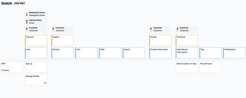

# Kravspecifikation - Snatch
## Martin og Danny

## 1.  Formål

## 2. Baggrund

### 2.1 Situation
Snatch A/S har en løsning fra 2007, der blev outsourcet til Uzbekistan. Dette har givet massive problemer, samt udfordringer grundet en uhensigtsmæssig sprogbarrierer. Platformen har gennem flere omgange, været omskrevet, af flere udviklingshuse - men resultatet er aldrig blevet godt. Kunderne samt virksomheder oplever regelmæssige nedbrud, samt problemer med betalinger og mistede ordrer.

Der har længe været et ønske om at få en mobil applikation udviklet. Da Snatch bløder kunder til konkurrenter der, tilbyder denne funktionalitet.

## 3. Overblik

### 3.1 Løsningsskitse

#### 3.2 Mål og kritiske succesfaktorer

#### 3.3 Nuværende Løsning og Problemformulering
Det nuværende system er en ASP.NET hjemmeside, udviklet i .NET 3.5.

Hvilken løsning kan vi lave, som vil optimere processen og mindske ressourceforbruget ved bestilling og levering af mad?
Hvad er problemet med de eksisterende processer?
Hvilke ændringer skal der til for at mindske ressourceforbruget ved bestilling og levering af mad?
Hvordan sørger vi for en skalérbar, modulopbygget og fremtidssikret løsning?
Hvordan sikrer vi løsningens kvalitet og tilgængelighed?

## 3.4 Fremtidig Løsning
### 3.4.1 Server
Backend bestående af en api løsning. Denne programmeres i PHP, med Lumen frameworket.
Lumen er et micro framework, som er henvendt til at lave API løsninger. JSON er data formatet som vi har valgt, da det gør integrationen med mobil applikationen nem, samt mulighed for senere integration med andre platforme eller interne applikationer.

### 3.4.2 Klient
Klienten er baseret på React Native, som er et cross platform framework til udvikling af GUI applikationer. Til dette projekt er fokus på mobil, dvs. Android og iOS. Men der er også mulighed for udvikling til macOS og Windows.

#### Firebase
Dette er en gratis løsning som er populær indenfor mobil apps. Her bruges push notifikations-servicen. Da vi på den måde slipper for at skulle udvikle en separat løsning til hver platform.

#### Google Maps SDK
Til visning af kort, er valget faldet på Google Maps. Applikationen skal være så ens, som muligt, på hver platform. Her er Google Maps oplagt, da Google selv står for udviklingen. Samt bliver kortene opdateret ofte. På den måde undgås det at vise uddaterede kort.

## 3.5 Konsekvenser for Organisationen
## 3.6 Krav til Implementering
## 3.7 Målgruppe
Der findes 3 konkrete målgrupper på Snatch platformen.

Restauranter - sælger madvare
Levering Bude - sælger levering fra restauranter til kunder
Kunder - Køber madvare hos restauranter, og køber yderligere levering fra Bude

## 4. Funktionelle Krav

### 4.2 User Interface Wireframes

### 4.3 Tidslinje

### 4.4 User Stories

Som led i den agile udviklingsmetodik, er værktøjet Featmap valgt til at samle user stories.
Det giver den fordel at de kan _mappes_ direkte til en specifik opgave.

En _Read Only_ version kan tilgås her [featmap.cptbarbossa.xyz](https://featmap.cptbarbossa.xyz/link/aeb7e4b1-31e3-4425-80f8-9d1a98e2e81d) 

#### 4.4.1 User flowchart

## 5. Ikke Funktionelle Krav
   5.1 Database Design
   Foreløbigt E/R Diagram
