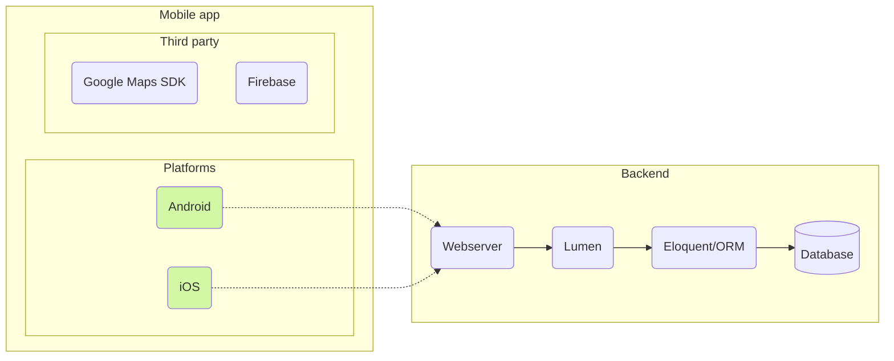
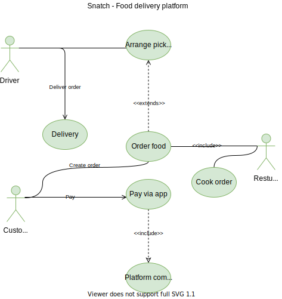
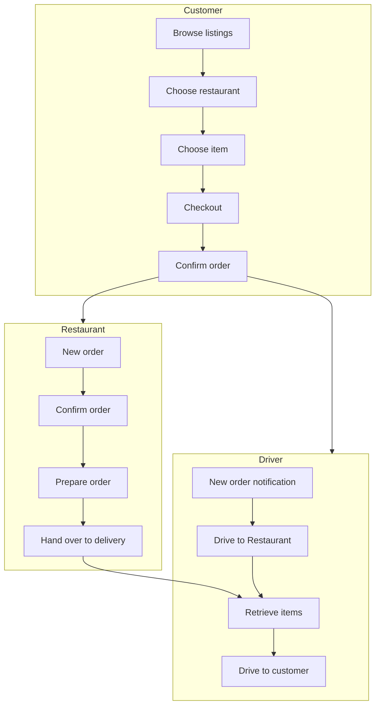
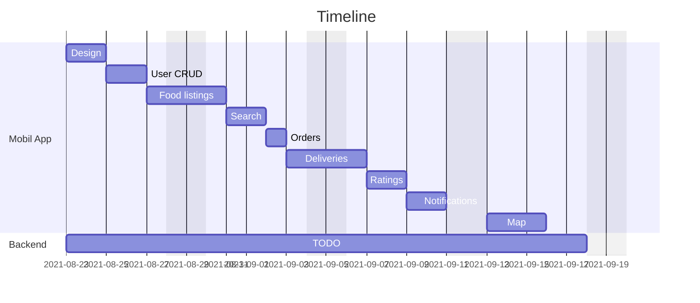

# Overview

```mermaid
graph LR
subgraph mobile-app[Mobile app]
    subgraph platforms[Platforms]
        a1(Android)
        b1(iOS)
    end

    subgraph thirdparty[Third party]
        c1(Google Maps SDK)
        d1(Firebase)
    end

    style a1 fill:#d3f8a5
    style b1 fill:#d3f8a5
end

a1-.-> a2
b1-.-> a2

subgraph backend[Backend]
    a2(Webserver)-->b2
    b2(Lumen)-->c2(Eloquent/ORM)
    c2-->d2[(Database)]
end
```

## Use case

## Flowchart

```mermaid
flowchart TD
    subgraph Customer
    A1[Browse listings] -->B1[Choose restaurant]
        B1 -->C1[Choose item]
        C1 -->D1[Checkout]
        D1 -->E1[Confirm order]
    end

    E1 -->Restaurant
    E1 -->Driver

    subgraph Restaurant
        A2[New order] -->B2[Confirm order]
        B2 -->C2[Prepare order]
        C2 -->D2[Hand over to delivery]
    end
    D2 -->C3

    subgraph Driver
        A3[New order notification] -->B3[Drive to Restaurant]
        B3 -->C3[Retrieve items]
        C3 -->D3[Drive to customer]
    end
```

## Project timeline

```mermaid
gantt
    title Timeline
    dateFormat  DD-MM-YYYY
    excludes    weekends
    
    section Mobil App
    Design           :a1, 2021-08-23, 2d
    User CRUD        :a2, after a1,   2d
    Food listings    :a3, after a2,   2d
    Search           :a4, after a3,   2d
    Orders           :a5, after a4,   1d
    Deliveries       :a6, after a5,   2d
    Ratings          :a7, after a6,   2d
    Notifications    :a8, after a7,   2d
    Map              :a9, after a8,   3d

    section Backend
    TODO      :2021-08-23,     20d
```
