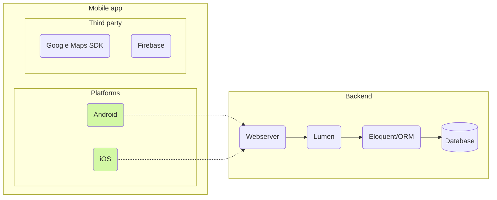
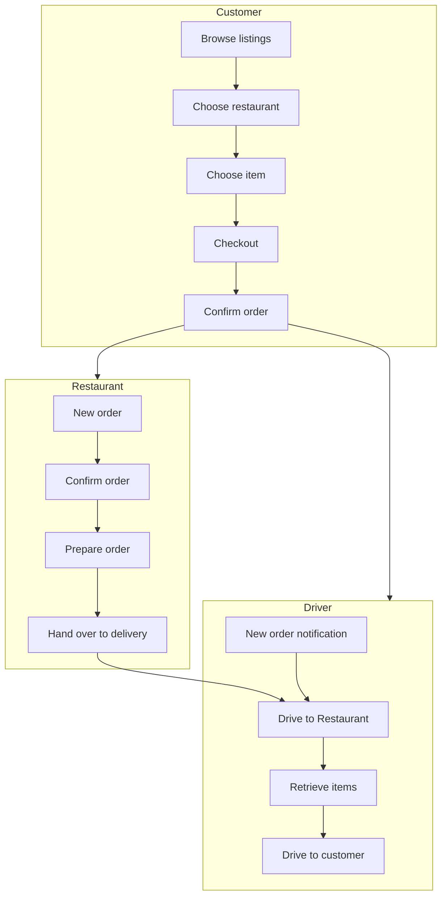

# Overview

[[toc]]

```mermaid
graph LR
subgraph mobile-app[Mobile app]
    subgraph platforms[Platforms]
        a1(Android)
        b1(iOS)
    end

    subgraph thirdparty[Third party]
        c1(Google Maps SDK)
        d1(Firebase)
    end

    style a1 fill:#d3f8a5
    style b1 fill:#d3f8a5
end

a1-.-> a2
b1-.-> a2

subgraph backend[Backend]
    a2(Webserver)-->b2
    b2(Lumen)-->c2(Eloquent/ORM)
    c2-->d2[(Database)]
end
```

## Use case

## Flowchart

```mermaid
flowchart TD
    subgraph Customer
    A1[Browse listings] -->B1[Choose restaurant]
        B1 -->C1[Choose item]
        C1 -->D1[Checkout]
        D1 -->E1[Confirm order]
    end

    E1 -->Restaurant
    E1 -->Driver

    subgraph Restaurant
        A2[New order] -->B2[Confirm order]
        B2 -->C2[Prepare order]
        C2 -->D2[Hand over to delivery]
    end
    D2 -->B3

    subgraph Driver
        A3[New order notification] -->B3[Drive to Restaurant]
        B3 -->C3[Retrieve items]
        C3 -->D3[Drive to customer]
    end
```
