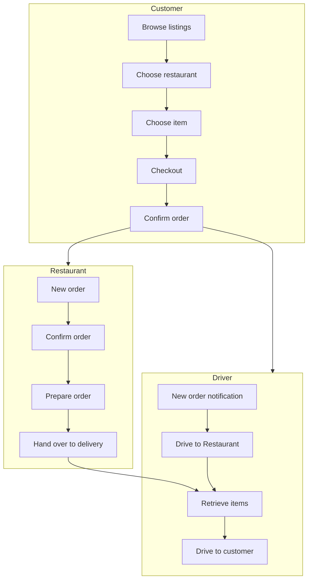
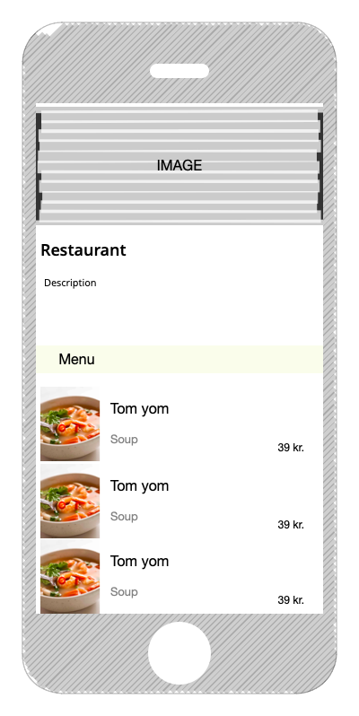
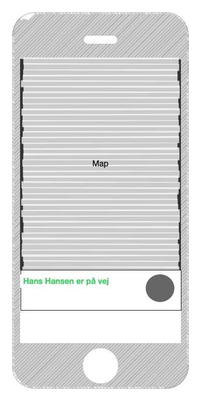
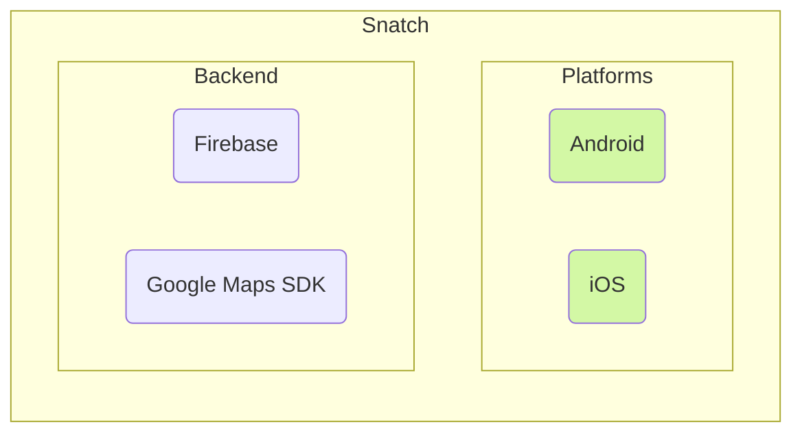

# Krav specifikation

Snatch A/S er en madportal der, har en løsning fra 2007, som blev outsourcet til udlandet Dette har givet massive
problemer, samt udfordringer grundet en uhensigtsmæssig sprogbarrierer. Platformen har gennem flere omgange, været
omskrevet, af flere udviklingshuse - men resultatet er aldrig blevet godt. Kunderne samt virksomheder oplever
regelmæssige nedbrud, problemer med betalinger og mistede ordrer. Der har længe været et ønske om at få en mobil
applikation udviklet. Da Snatch bløder kunder til konkurrenter der, tilbyder denne funktionalitet.

## Nuværende Løsning og Problemformulering

Det nuværende system er en ASP.NET hjemmeside, udviklet i .NET 3.5.

Hvilken løsning kan vi lave, som vil optimere processen og mindske ressourceforbruget ved bestilling og levering af mad?
Hvad er problemet med de eksisterende processer? Hvilke ændringer skal der til for at mindske ressourceforbruget ved
bestilling og levering af mad? Hvordan sørger vi for en skalérbar, modulopbygget og fremtidssikret løsning? Hvordan
sikrer vi løsningens kvalitet og tilgængelighed?

## Projekt Scope

Formålet med applikationen er at gøre det nemt for forbrugere at bestille og få leveret mad. Restauranterne slipper for
selv at skulle ansætte leveringsbude, som giver luft til at fokuserer på deres forretning.

Håndteringen af levering mellem restaurant og leveringsbud bliver koordineret af det bagvedliggende system. Som kunde
kan man følge med i leverancen på et kort, fra at man har bestilt, til modtagelsen.

## Bruger karakteristik

### Roller

Brugerfladen har forskellig funktionalitet som indskrænkes alt efter hvilken rolle brugeren har.

#### Kunde

- Se restauranter
- Se menukort
- Opret/Annuller Ordrer
- Chat med leveringsbud

#### Leveringsbud

- Bekræft udbringning
- Aflys udbringning
- Chat med modtager

#### Restaurant

- Adresse (Opret, Rediger, Slet)
- Menukort (Opret, Rediger, Slet)
- Ordrer
    - Annuller
    - Bekræft

## Bestillingsflow diagram

## Personaer

#### Kunde (John Smith)

John er en travl familiefar på 42 år. Han har ikke tid til at stå for at lave mad i hverdagen, som gør han ofte køber
take-away. Dette går der meget tid med, så derfor ønsker han en løsning hvor han kan bestille mad, og med ret høj
sikkerhed vide hvornår han kan forvente leveringen. Da det ofte har været et problem at restauranterne ikke har
informeret ham om uhensigtsmæssige forsinkelser.

#### Leveringsbud (Jane Doe)

Jane er en studerende på 19 år. Hun bor midt i Odense og ønsker et studiejob hvor hun kan køre rundt i byen på sin
knallert.

#### Restaurant (Tom Yom)

_Tom Yom_ er en Odenseansk restaurant der før covid-19 epidemien havde en høj omsætning. Grundet lockdown perioder, og
at deres kundesegment er blevet mere forsigtige, har de mistet en stor mængde kunder, da de ikke bruger ud.
_Tom Yom_ ønsker en nem måde at få deres mad solgt og leveret ud til kunder. Uden at skulle ansætte leveringsbude, og
ikke skulle drifte egen app/hjemmeside.

## User Stories

### Oprettelse

Som gæst vil jeg gerne have mulighed for at oprette en bruger

#### Krav

- Mulighed for at bruge Single Sign On (e.g. Google Sign in)
- Mulighed for at bruge egen email og selvvalgt kodeord

#### Acceptkriterier

- For at undgå dobbeltkonti, skal OAuth og Email/Kodeord konti flettes sammen automatisk
- Hvis en bruger forsøger at oprette sig med en eksisterende email, og har valgt kodeordsflowet, skal der vises en fejl
- Hvis udfyldt korrekt, skal kontoen oprettes

### Log ind

Som eksisterende bruger skal jeg kunne logge ind på min konto

#### Krav

- Felter til at udfylde email & kodeord
- Knapper til Single Sign On

#### Acceptkriterier

- Hvis oplysningerne er korrekte, skal brugeren logges ind, ellers skal der vises en fejl

### Glemt kodeord

Som bruger, hvis jeg har glemt mit kodeord, skal jeg have mulighed for at nulstille

#### Krav

- Knap på log ind skærmen, til nulstilling af kodeord

#### Acceptkriterier

- Hvis email adressen eksisterer skal brugeren modtage en email med et nulstillingslink

### Ændrer adresse

Som kunde vil jeg gerne kunne ændre den adresse jeg modtager mad på

#### Krav

- Felt i profilsiden til ændring af adresse
- Adressen skal verificeres med Google Maps
- Knap til at bruge nuværende lokation som adresse

#### Acceptkriterier

- Hvis adressen ikke findes, skal der vises en fejl
- Adressen gemmes på profilen

### Se restauranter

Som kunde vil jeg gerne kunne se restauranter

#### Krav

- Liste med restauranter
- Når man trykker på en restaurant skal appen henvise til dennes side

#### Acceptkriterier

- Ved indlæsning skal brugerfladen indikerer dette

### Bestille mad

Som kunde vil jeg gerne kunne se en restaurants menukort og bestille mad

#### Krav

- Vis menukort som liste
- Hvert produkt skal have en side hvor man kan tilføje madvaren til kurven
- Det skal kun være muligt at bestille fra en énkelt restaurant per indkøbskurv

#### Acceptkriterier

- Hvis brugeren prøver at tilføje produkter fra en anden restaurant, skal der vises en fejlbesked

### Følge levering

Som kunde vil jeg gerne kunne følge leverancen af min ordrer

#### Krav

- Vis leveringsbud på kort

#### Acceptkriterier

- Kortet skal opdateres med positionen live

### Foretage levering

Som leveringsbud vil jeg gerne kunne levere mad

#### Krav

- Modtag notifikation om ny ordrer
- Knap til markere ordreren som leveret

#### Acceptkriterier

- Kunde og restaurant notificeres ved accept/afslag

### Ændrer menukort

Som restaurant vil jeg gerne kunne ændrer i mit menukort

#### Krav

- Opret nyt produkt
- Redigér eksiterende produkt
- Slet eksisterende produkt

#### Acceptkriterier

- Vis fejlbesked hvis følgende felter mangler: _navn, beskrivelse, pris_
- Produktet skal vises efter oprettelse

## Brugerflade

Appen har specielt fokus på at vise et indbydende menukort samt at følge med i leveringen.
Det er disse funktionaliteter som _Snatch_ vil have skaber omtale.

### Restaurant - Menukort

### Ordrer - Tracking

## Fremtidig løsning

### Firebase

Til projektets backend er valget faldet på _Firebase_ da det er en _Platform-as-a-Service_ udviklet og driftet af
Google, som gør vi sparer tid på at udvikle lignende funktionalitet. Det er en veldokumenteret populær platform. Det er
også nemt at, finde udviklere der har erfaring med Firebase - som er et stort plus når vi snakker fremtidssikring.

### React Native

Klienten er baseret på React Native, som er et cross platform framework til udvikling af GUI applikationer. Til dette
projekt er fokus på mobil, dvs. Android og iOS. Men der er også mulighed for udvikling til macOS og Windows.

### Google Maps SDK

Til visning af kort, er valget faldet på Google Maps. Applikationen skal være så ens, som muligt, på hver platform. Her
er Google Maps oplagt, da Google selv står for udviklingen. Samt bliver kortene opdateret ofte. På den måde undgås det
at vise uddaterede kort.

## Ikke Funktionelle Krav

### Tilgængelighed (Brugerflade)

Systemet skal udvikles til at kunne bruges af så bred en kundebase som det er, der bestiller mad.
Der skal tages højde for ikke at overkomplicerer vejen til brugeren mål, nemlig at bestille og modtage mad.

Her skal der tænkes på at bruge farver, der stadig vil give den korrekte kontrast i forhold til farveblindhed.
Det skal være muligt at bruge skærmlæser eksempelvis _Apple VoiceOver_

### Forudsætninger

For at kunne anvende mobil applikationen, skal man have én af følgende enheder:

- Apple iPhone/iPod Touch/iPad med minimum iOS 12.0
- Android telefon/tablet med minimum Android 9