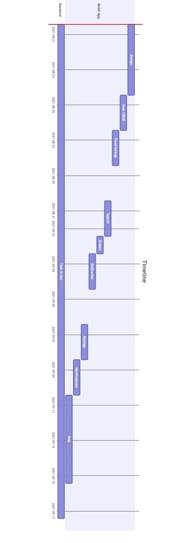

# Procesrapport

## Problemstilling

Snatch, en virksomhed i skarp vækst - der koordinerer madbestillinger mellem kunder, leverandører og restauranter, står
i den situation at de vil overgå til en app baseret platform.

Appen skal løse følgende kerne problemstillinger:

+ Kunder der vil have mere indblik i hvornår de modtager deres leverancer.
+ Leverandører der køre ud for flere restauranter, skal informeres når der er leverancer klar.
+ Restauranter skal modtage ordrer, og kan herefter få dem leveret - uden at skulle kontakte leverandøren

## Fremtidssikring

Appen anvender populære teknologier, der er bakket op af større virksomheder som Google (Firebase) og Facebook (React
Native), og data overførselsprotokollen udelukkende består af JSON objekter - mener vi at, der er lagt et godt fundament
for fremtidig udvikling.

Software kernen består af nøje udvalgte biblioteker, der har en hvis popularitet. Samt tjekket igennem for at sikre, at
de __ikke__ er licenseret med licenser der, kunne skabe problemer i forhold til ophavsret.

React Native har også runtimes til macOS, Windows og Web - hvilket giver mulighed for at dele samme kodebase på tværs.

## Sikkerhed

### OAUTH

Vi anvender Firebase Authentication, som giver nem integration med Apple og Google Sign-in. På denne måde outsourcer vi
sikkerheden, sparer udviklingstid og får en langt højere sikkerhed der, er verificeret hos Google.

### Cloud Firestore Sikkerhedspolitikker

Cloud Firestore Security Rules er en DSL til at opbygge adgangskontrol (ACL) samt datavalidering. I sammenhæng med
Firebase Authentication, er hele databasen beskyttet ned på attribut niveau - for at undgå uhensigtsmæssig datalæk bland
bruger profiler.

## Teknologier

### Firebase

Backend as a service. Populær blandt app udviklere, man kan "springe" udviklingen af backend'en over.

#### Authentication

Login service - her anvendes Apple Sign-In og Google Sign-In

#### Crashlytics

Opsamling af crash rapporter til videre analysering af os

#### Cloud Functions

Serverless funktioner

#### Dynamic Links

Bruges til at rute _deep links_ fra eksempelvis en hjemmeside, ind til et view i appen

#### Firestore

Dokument database (NoSQL)

#### Storage

Data lag til at gemme og vise billeder

### React Native

Crossplatform framework til udvikling af applikationer på tværs af mobil og desktop. Denne app anvender kun

### TypeScript

Et supersæt af JavaScript, der introducerer typer i JavaScript. Drager stor inspiration fra C#, da det er samme
forfatter Anders Hejlsberg, der skrev sproget.

### GitHub

Github hoster git serveren, som koden er versioneret på. Servicen må bruges gratis til kommercielt brug, hvilket gør den
attraktiv for virksomheder.

### Featmap

User story mapping tool til oprettelse af user stories med link til issues.

### WebStorm

Et JetBrains produkt til udvikling af software der er skrevet i JavaScript/TypeScript. Licens pris: €12.90 per måned
eller €129 om året

## Tidslinje (GANTT)

## Logbog - Martin (Frontend)

All notable changes to this project will be documented in this file.
See [Conventional Commits](https://conventionalcommits.org) for commit guidelines.

### [1.6.0](https://github.com/martin-juul/snatch/compare/v1.5.0...v1.6.0) (2021-09-29)

#### Bug Fixes

* **basket:** merge item if added
  again ([61e35cf](https://github.com/martin-juul/snatch/commit/61e35cf7555a31741fbe724ab768d1832db68cea))

#### Features

* **order:** submit order to
  firestore ([17fb07a](https://github.com/martin-juul/snatch/commit/17fb07a2b5138f251bec2d6e91ae5af8a902b0d0))

### [1.5.0](https://github.com/martin-juul/snatch/compare/v1.4.0...v1.5.0) (2021-09-22)

#### Bug Fixes

* module name for
  typings ([b8d841e](https://github.com/martin-juul/snatch/commit/b8d841e3eb5b7f034af89f7e0ebe15cbdcfc76e6))

#### Features

* **basket:** added basket screen and state
  handling ([efb4ddf](https://github.com/martin-juul/snatch/commit/efb4ddf2839428373f11826616388ccf8c14657d))
* **profile:** added
  screen ([924b5f3](https://github.com/martin-juul/snatch/commit/924b5f3ceeb8e436ec06063ccc85cef8c62acfd2))
* **restaurant:** added basket
  screen ([ff02a33](https://github.com/martin-juul/snatch/commit/ff02a3338ba86c97a482b0fca4b643a535ed9fbb))

# [1.4.0](https://github.com/martin-juul/snatch/compare/v1.3.0...v1.4.0) (2021-09-17)

#### Bug Fixes

* **auth:** throw custom auth
  error ([067dc2e](https://github.com/martin-juul/snatch/commit/067dc2e11ee3f004b438b15de4af66ed93cfdeb9))
* **button-presets:** created secondary ViewStyle
  preset ([16049cd](https://github.com/martin-juul/snatch/commit/16049cd8c12786f9c138a87635203e7d6859377f))
* **Chat:** set avatar to empty string to prevent source
  error ([447e8fa](https://github.com/martin-juul/snatch/commit/447e8fa97290c00d7ed4995c40a5c19afa330886))
* **OrderTrackingScreen:** remove redundant
  header ([3bd4eff](https://github.com/martin-juul/snatch/commit/3bd4eff9d689bdef9fce06883860228f97f5fb6b))

#### Features

* **settings:** added language switcher and integrated yup
  locale ([b7db07c](https://github.com/martin-juul/snatch/commit/b7db07c25fec40eb41e7755319832acb29cd8f54))
* **sign-in:** added password sign in & fixed
  layout ([3453e2e](https://github.com/martin-juul/snatch/commit/3453e2e86d754331a5bb59a01f0e2ce4ddf77ddb))

### [1.3.0](https://github.com/martin-juul/snatch/compare/v1.2.0...v1.3.0) (2021-09-17)

#### Bug Fixes

* **app:** set isLoading to false once bootstrap has
  finished ([156b255](https://github.com/martin-juul/snatch/commit/156b255e61c493f437d05c6d34db65d5c51c8a4a))

#### Features

* **button:** added secondary
  preset ([7da52ff](https://github.com/martin-juul/snatch/commit/7da52ff8729873647dcf089626288eecc05404be))
* **orders:** added chat to tracking
  screen ([32de9bb](https://github.com/martin-juul/snatch/commit/32de9bbef8e7b4c2e8959005f3302b93efc58262))
* **restaurant-detail-screen:** show items as
  cards ([54aad89](https://github.com/martin-juul/snatch/commit/54aad898ddbae95476a8f1ce12bcc330d6544e60))
* **restaurant-list-screen:** improved ui with pretty
  cards ([4174220](https://github.com/martin-juul/snatch/commit/4174220e923cccdc2f3d1dbfe7010bfc7982a4e1))
* **settings:** added navigator &
  screen ([ce807a2](https://github.com/martin-juul/snatch/commit/ce807a2f47feb01acef06b386d2438f7a0aa1076))
* **settings:** added
  screen ([ec1edf5](https://github.com/martin-juul/snatch/commit/ec1edf513c5db350bf577e5b801d0698e2d40c9b))
* **text:** extend from
  ui-lib ([1591556](https://github.com/martin-juul/snatch/commit/159155639db9fcec5f80fc4fbae9267a022a3389))

#### Reverts

* Revert "v1.3.0" ([636322d](https://github.com/martin-juul/snatch/commit/636322d027d1e0cb004a4b59c00b3b056fa43990))

### [1.2.0](https://github.com/martin-juul/snatch/compare/v1.1.0...v1.2.0) (2021-09-16)

#### Bug Fixes

* **ios:** make sure firebase is only loaded
  once ([13b85db](https://github.com/martin-juul/snatch/commit/13b85db56731a00a64e9f022c9e76558721d60c5))

#### Features

* added icons ([ff4a220](https://github.com/martin-juul/snatch/commit/ff4a220d896b421af7a1158a5b2aad7b47043c93))
* **app:** added android
  icons ([8d2df01](https://github.com/martin-juul/snatch/commit/8d2df01ae53fb861a1217bdddd32891d6295248d))
* **app:** added ios
  icons ([feb4625](https://github.com/martin-juul/snatch/commit/feb462524171e7d097b6f773342098b87d2b30ec))
* **auth:** added sign in with
  Google ([464a9d8](https://github.com/martin-juul/snatch/commit/464a9d881fa08c90118ae82477ba6134857a04c3))
* **ios:** added
  GoogleService-Info.plist ([9d717b3](https://github.com/martin-juul/snatch/commit/9d717b329c6317cc0c25560ef39197a0df10dd96))

### 1.1.0 (2021-09-15)

#### Bug Fixes

- added .gitignore and removed .idea
  dir ([d8c36be](https://github.com/martin-juul/snatch/commit/d8c36be134d68c0b77f9f5c5ba7908d45ebebdc5))
- app package ([e2eef00](https://github.com/martin-juul/snatch/commit/e2eef006ea0c5945bdd31278da0a121e1938a8b5))
- build by re-init
  project ([38d7ae5](https://github.com/martin-juul/snatch/commit/38d7ae59e03efbf199f9f2687964b0c579318565))
- detix ([74bc000](https://github.com/martin-juul/snatch/commit/74bc00008ccd3e47e4d3c3920e61d3b5951a343f))
- **docs:**
  deployment ([eab4ad4](https://github.com/martin-juul/snatch/commit/eab4ad443b7d021c13d61195d5faefc19dc39ad7))
- **docs:** fixed clowchart docs: added Gantt chart showing
  timeline ([53b345a](https://github.com/martin-juul/snatch/commit/53b345a6bb4ee9df9e33273ecb773461edbc5346))
- ignore .env ([fded9ad](https://github.com/martin-juul/snatch/commit/fded9ad40126a18b8181f9f4b5a3c1cd27d94315))
- **ios:** added new
  Podfile.lock ([4a1b41a](https://github.com/martin-juul/snatch/commit/4a1b41a4b19c59e0b320b9fa3fbf3766c7a6bf65))
- **openapi:** removed non-standard
  props ([916dbc2](https://github.com/martin-juul/snatch/commit/916dbc244d1dfb85bfacc6422c881e3cb987de1e))
- remove .env file ([5547768](https://github.com/martin-juul/snatch/commit/5547768bf866ed2d3d1eb0b0e135c2bd83a18f23))
- remove console.tron
  calls ([d55a3b7](https://github.com/martin-juul/snatch/commit/d55a3b7aaa6923c45066934f6d70ec8537630602))
- removed firebase performance, fixes
  crashes ([88ad59c](https://github.com/martin-juul/snatch/commit/88ad59cf9ebf98418fd00b65011a95c1a773b6f3))
- **screens:** fix export for
  restaurant-detail-screen ([d7b63f4](https://github.com/martin-juul/snatch/commit/d7b63f49fb786b790562955130646854c4dae997))
- **TextProps:** don't import UMD
  global ([55322c9](https://github.com/martin-juul/snatch/commit/55322c9f19fa07246beebc73d6ec2304b644c590))

#### Features

- added firebase.json ([35696f5](https://github.com/martin-juul/snatch/commit/35696f52a74f7a45b84f0d40e1dd8fc3edc852dd))
- added openapi
  schema ([11f3d1d](https://github.com/martin-juul/snatch/commit/11f3d1db4147bd2eaf8be57cc1748840f3fdc0dd))
- added redux ([71ba9d6](https://github.com/martin-juul/snatch/commit/71ba9d6925a26396f9d7c6484340d47561938d3a))
- added useDebounce
  hook ([1b8fe7f](https://github.com/martin-juul/snatch/commit/1b8fe7fe690888cd7cad499ff11015894ee4bf9d))
- **docs:** added
  @vuepress/active-header-links ([432baca](https://github.com/martin-juul/snatch/commit/432baca903e89009dfd5393d42517e33ee937fd7))
- **ios:** init firebase in
  AppDelegate ([9d64bca](https://github.com/martin-juul/snatch/commit/9d64bcac72ed7e76b35ee5668e4e87f19bb43298))
- **lang:** added language
  context ([606f1bb](https://github.com/martin-juul/snatch/commit/606f1bb4feaaafa3b57ba8ea518bc61e89951cec))
- maps prototype ([e6d6021](https://github.com/martin-juul/snatch/commit/e6d6021a054a302aae8d0564ed619fc670b2035a))
- **OrderTracking:** added mock scooter
  path ([a68e73a](https://github.com/martin-juul/snatch/commit/a68e73ad3052127e83e65582c996ad4bb6537490))
- **restaurantListScreen:** improved
  styling ([d98a9f0](https://github.com/martin-juul/snatch/commit/d98a9f0c0994371ea7003aa8a4c1a2c3dfd21b2a))
- **RestaurantListScreen:** lookup items from
  firestore ([7af961e](https://github.com/martin-juul/snatch/commit/7af961e795dba2e5e673e23f6b47db7e4efac579))
- **restaurants:** added list
  screen ([14e2982](https://github.com/martin-juul/snatch/commit/14e298244b00e6cc0fea32d2ebb46f49d5646dd4))
- **restaurants:** added test api & mobx
  integration ([c413295](https://github.com/martin-juul/snatch/commit/c413295534581c2dcba04665e38a7052a762308d))

Sprint Review Frontend

Backend

Konklusion

