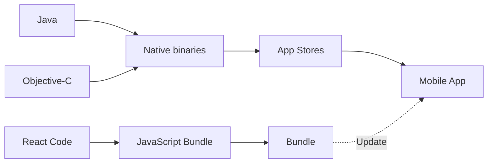
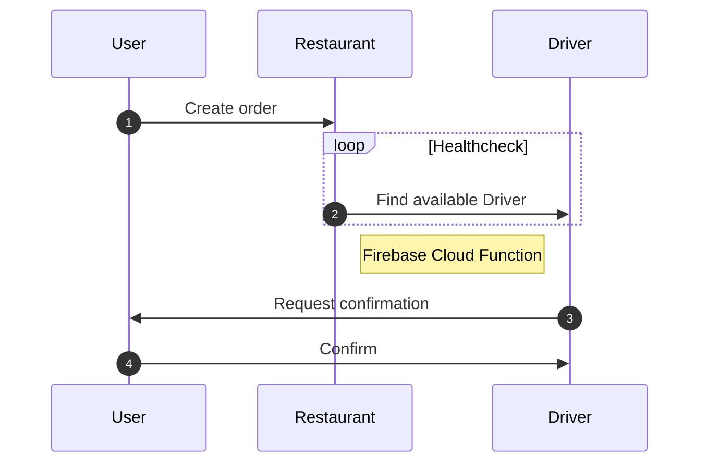

# Produkt Rapport

## Problemstilling

Appen skal løse følgende kerne problemstillinger:

+ Kunder der vil have mere indblik i hvornår de modtager deres leverancer.
+ Leverandører der køre ud for flere restauranter, skal informeres når der er leverancer klar.
+ Restauranter skal modtage ordrer, og kan herefter få dem leveret - uden at skulle kontakte leverandøren

## Fremtidssikring

Appen anvender populære teknologier, der er bakket op af større virksomheder som Google (Firebase) og Facebook (React
Native), og data overførselsprotokollen udelukkende består af JSON objekter - mener vi at, der er lagt et godt fundament
for fremtidig udvikling.

Software kernen består af nøje udvalgte biblioteker, der har en hvis popularitet. Samt tjekket igennem for at sikre, at
de __ikke__ er licenseret med licenser der, kunne skabe problemer i forhold til ophavsret.

React Native har også runtimes til macOS, Windows og Web - hvilket giver mulighed for at dele samme kodebase på tværs af
platformene.

### Hotfixing

CodePush er en microsoft udviklet teknologi til React Native der, gør det muligt at hotfixe/live-patche den kompilerede
JavaScript kode samt assets eksempelvis billeder eller skiftyper.

Dette giver mulighed for at udgive opdateringer der ikke afhænger af ændringer i den platform specifikke kode.



CodePush er understøttet på Android, iOS og Windows.

Teknologien er valgt da CodePush platformen er stillet til rådighed som en gratis service fra Microsoft. Skulle det en
dag komme til at koste penge, kan man allerede idag skifte til en tredjeparts tjeneste eller vælge at hoste
selv. [github.com/lisong/code-push-server](https://github.com/lisong/code-push-server)

## Arbejdsmetode

### Changelogs

For at have en brugbar `commit log` og _changelogs_, er [Conventional Commits](https://www.conventionalcommits.org/en/v1.0.0/#specification) specifikationen anvendt.

| Commit prefix | Scope                    | Forklaring                                                                               |
|---------------|--------------------------|------------------------------------------------------------------------------------------|
| feat          | Features                 | En ny feature                                                                            |
| fix           | Bug fixes                | Fejlrettelse                                                                             |
| docs          | Documentation            | Ændringer der kun vedrører dokumentationen                                               |
| style         | Styles                   | Ændringer, der ikke påvirker kodens betydning (whitespace, formatering, opstilning etc.) |
| refactor      | Code refactoring         | En kodeændring, der hverken retter en fejl eller tilføjer en funktion                    |
| perf          | Performance improvement  | En kodeændring, der forbedrer ydeevnen                                                   |
| test          | Tests                    | Tilføjelse af manglende tests eller korrektion af eksisterende tests                     |
| build         | Builds                   | Ændringer, der påvirker byggesystemet                                                    |
| ci            | Continuous Integrations  | Ændringer af vores CI -konfigurationsfiler og scripts                                    |
| chore         | Chores                   | Andre ændringer, der ikke ændrer applikationsspecifik kildekode eller testfiler          |
| revert        | Reverts                  | Gå tilbage til et tidligere commit                                                       |

## Ordrerbehandling



### Beregning af distance

Når en bruger opretter en ordrer, bliver udbringeren fundet ved at slå alle udbringere op i databasen, beregnet på den
mindste afstand i fugleflugt. Denne løsning er valgt, da det vil være for dyrt at bruge et api kald, til beregning af
den reelle afstand med f.eks. Google Maps Directions.

```typescript
/**
 * Converts numeric degrees to radians
 * @param {number} val
 *
 * @return {number}
 */
function toRad(val: number) {
  return val * Math.PI / 180;
}

export interface GeoPoint {
  latitude: number;
  longitude: number;
}

/**
 * Calculates the Crow distance between 2 geographic points
 * @param {GeoPoint} point1
 * @param {GeoPoint} point2
 *
 * @return {number}
 */
export function calculateCrowDistance(point1: GeoPoint, point2: GeoPoint): number {
  const R = 6371; // km
  const dLat = toRad(point2.latitude - point1.latitude);
  const dLon = toRad(point2.longitude - point1.longitude);
  const lat1 = toRad(point1.latitude);
  const lat2 = toRad(point2.longitude);

  const a = Math.sin(dLat / 2) * Math.sin(dLat / 2) + Math.sin(dLon / 2) * Math.sin(dLon / 2) * Math.cos(lat1) * Math.cos(lat2);
  const c = 2 * Math.atan2(Math.sqrt(a), Math.sqrt(1 - a));

  return R * c;
}
```

_Bemærk: Du kan scrolle horisontalt_

## Sikkerhed

### OAuth

Vi anvender Firebase Authentication, som giver nem integration med Apple og Google Sign-in. På denne måde outsourcer vi
sikkerheden, sparer udviklingstid og får en langt højere sikkerhed der, er verificeret hos Google.

## Teknologier

### Firebase

Backend as a service. Populær blandt app udviklere, man kan "springe" udviklingen af backend'en over.

#### Authentication

Login service - her anvendes Apple Sign-In og Google Sign-In

#### Crashlytics

Opsamling af crash rapporter til videre analysering af os

#### Cloud Functions

Serverless funktioner

#### Dynamic Links

Bruges til at rute _deep links_ fra eksempelvis en hjemmeside, ind til et view i appen

#### Firestore

Dokument database (NoSQL)

#### Storage

Data lag til at gemme og vise billeder

### React Native

Crossplatform framework til udvikling af applikationer på tværs af mobil og desktop. Denne app anvender kun

### TypeScript

Et supersæt af JavaScript, der introducerer typer i JavaScript. Drager stor inspiration fra C#, da det er samme
forfatter Anders Hejlsberg, der skrev sproget.

### GitHub

Github hoster git serveren, som koden er versioneret på. Servicen må bruges gratis til kommercielt brug, hvilket gør den
attraktiv for virksomheder.

### Featmap

User story mapping tool til oprettelse af user stories med link til issues.

### WebStorm

Et JetBrains produkt til udvikling af software der er skrevet i JavaScript/TypeScript. Licens pris: €12.90 per måned
eller €129 om året

## Biblioteker

### [react-native-unimodules](https://docs.expo.dev/bare/installing-unimodules/)

En samling af moduler brug som bruges i [expo](https://expo.dev/). Unimodules er installeret i projektet for at gøre
brug af expo specifikke moduler.

### [wix/react-native-navigation]()

Biblioteket gør det muligt at have en central logik til navigation mellem skærme _(Screens)_, og samtidig have en menu i
toppen og bunden.
