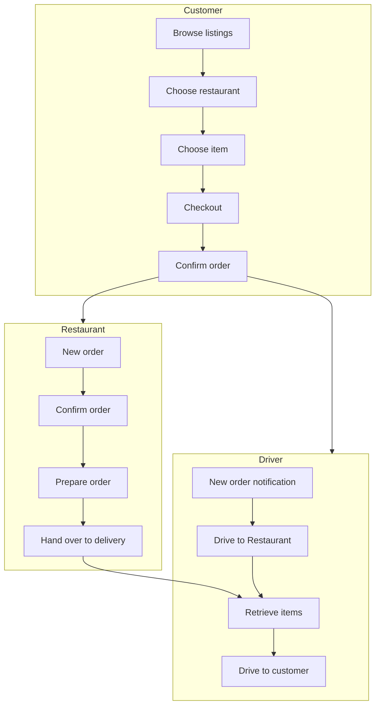
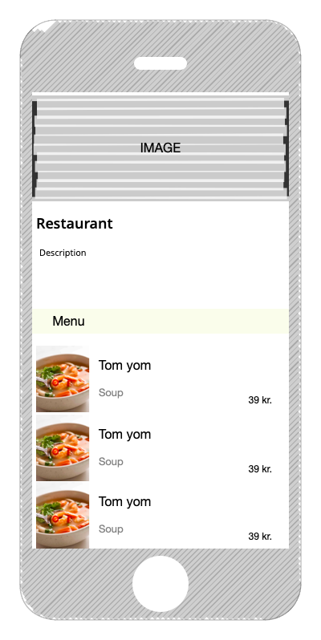
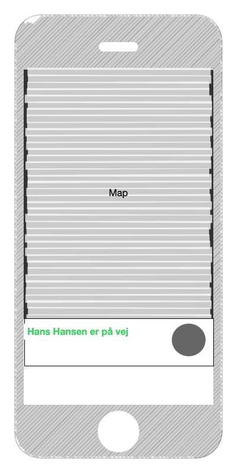
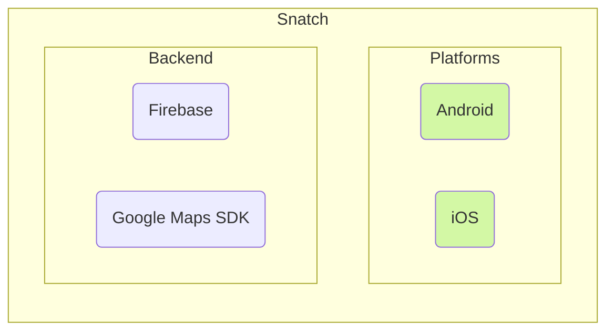
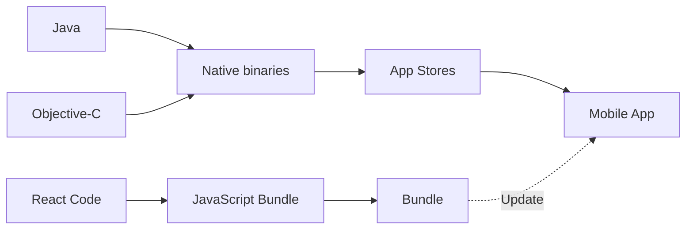
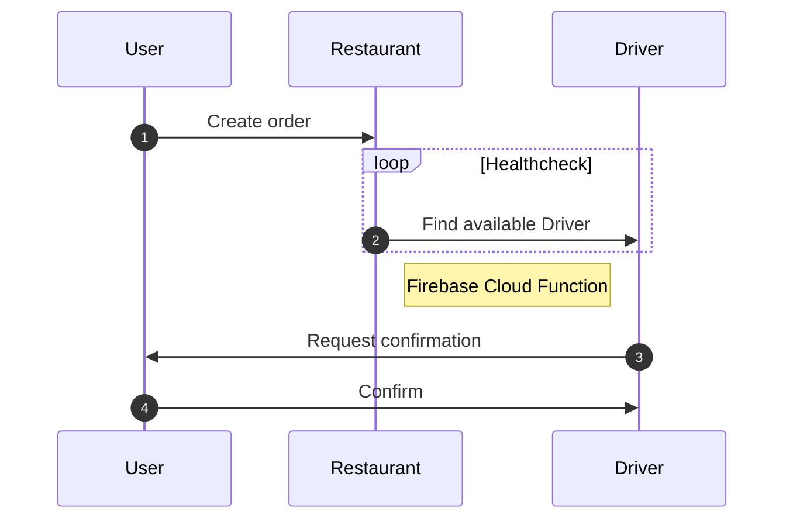

# Produkt Rapport

## Krav specifikation

Snatch A/S er en madportal der, har en løsning fra 2007, som blev outsourcet til udlandet Dette har givet massive
problemer, samt udfordringer grundet en uhensigtsmæssig sprogbarrierer. Platformen har gennem flere omgange, været
omskrevet, af flere udviklingshuse - men resultatet er aldrig blevet godt. Kunderne samt virksomheder oplever
regelmæssige nedbrud, problemer med betalinger og mistede ordrer. Der har længe været et ønske om at få en mobil
applikation udviklet. Da Snatch bløder kunder til konkurrenter der, tilbyder denne funktionalitet.

## Problemstilling

Appen skal løse følgende kerne problemstillinger:

+ Kunder der vil have mere indblik i hvornår de modtager deres leverancer.
+ Leverandører der køre ud for flere restauranter, skal informeres når der er leverancer klar.
+ Restauranter skal modtage ordrer, og kan herefter få dem leveret - uden at skulle kontakte leverandøren

## Nuværende Løsning og Problemformulering

Det nuværende system er en ASP.NET hjemmeside, udviklet i .NET 3.5.

Hvilken løsning kan vi lave, som vil optimere processen og mindske ressourceforbruget ved bestilling og levering af mad?
Hvad er problemet med de eksisterende processer? Hvilke ændringer skal der til for at mindske ressourceforbruget ved
bestilling og levering af mad? Hvordan sørger vi for en skalérbar, modulopbygget og fremtidssikret løsning? Hvordan
sikrer vi løsningens kvalitet og tilgængelighed?

## Projekt Scope

Formålet med applikationen er at gøre det nemt for forbrugere at bestille og få leveret mad. Restauranterne slipper for
selv at skulle ansætte leveringsbude, som giver luft til at fokuserer på deres forretning.

Håndteringen af levering mellem restaurant og leveringsbud bliver koordineret af det bagvedliggende system. Som kunde
kan man følge med i leverancen på et kort, fra at man har bestilt, til modtagelsen.

## Bruger karakteristik

### Roller

Brugerfladen har forskellig funktionalitet som indskrænkes alt efter hvilken rolle brugeren har.

#### Kunde

- Se restauranter
- Se menukort
- Opret/Annuller Ordrer
- Chat med leveringsbud

#### Leveringsbud

- Bekræft udbringning
- Aflys udbringning
- Chat med modtager

#### Restaurant

- Adresse (Opret, Rediger, Slet)
- Menukort (Opret, Rediger, Slet)
- Ordrer
    - Annuller
    - Bekræft

## Bestillingsflow diagram



## Personaer

#### Kunde (John Smith)

John er en travl familiefar på 42 år. Han har ikke tid til at stå for at lave mad i hverdagen, som gør han ofte køber
take-away. Dette går der meget tid med, så derfor ønsker han en løsning hvor han kan bestille mad, og med ret høj
sikkerhed vide hvornår han kan forvente leveringen. Da det ofte har været et problem at restauranterne ikke har
informeret ham om uhensigtsmæssige forsinkelser.

#### Leveringsbud (Jane Doe)

Jane er en studerende på 19 år. Hun bor midt i Odense og ønsker et studiejob hvor hun kan køre rundt i byen på sin
knallert.

#### Restaurant (Tom Yom)

_Tom Yom_ er en Odenseansk restaurant der før covid-19 epidemien havde en høj omsætning. Grundet lockdown perioder, og
at deres kundesegment er blevet mere forsigtige, har de mistet en stor mængde kunder, da de ikke bruger ud.
_Tom Yom_ ønsker en nem måde at få deres mad solgt og leveret ud til kunder. Uden at skulle ansætte leveringsbude, og
ikke skulle drifte egen app/hjemmeside.

## User Stories

### Oprettelse

Som gæst vil jeg gerne have mulighed for at oprette en bruger

#### Krav

- Mulighed for at bruge Single Sign On (e.g. Google Sign in)
- Mulighed for at bruge egen email og selvvalgt kodeord

#### Acceptkriterier

- For at undgå dobbeltkonti, skal OAuth og Email/Kodeord konti flettes sammen automatisk
- Hvis en bruger forsøger at oprette sig med en eksisterende email, og har valgt kodeordsflowet, skal der vises en fejl
- Hvis udfyldt korrekt, skal kontoen oprettes

### Log ind

Som eksisterende bruger skal jeg kunne logge ind på min konto

#### Krav

- Felter til at udfylde email & kodeord
- Knapper til Single Sign On

#### Acceptkriterier

- Hvis oplysningerne er korrekte, skal brugeren logges ind, ellers skal der vises en fejl

### Glemt kodeord

Som bruger, hvis jeg har glemt mit kodeord, skal jeg have mulighed for at nulstille

#### Krav

- Knap på log ind skærmen, til nulstilling af kodeord

#### Acceptkriterier

- Hvis email adressen eksisterer skal brugeren modtage en email med et nulstillingslink

### Ændrer adresse

Som kunde vil jeg gerne kunne ændre den adresse jeg modtager mad på

#### Krav

- Felt i profilsiden til ændring af adresse
- Adressen skal verificeres med Google Maps
- Knap til at bruge nuværende lokation som adresse

#### Acceptkriterier

- Hvis adressen ikke findes, skal der vises en fejl
- Adressen gemmes på profilen

### Se restauranter

Som kunde vil jeg gerne kunne se restauranter

#### Krav

- Liste med restauranter
- Når man trykker på en restaurant skal appen henvise til dennes side

#### Acceptkriterier

- Ved indlæsning skal brugerfladen indikerer dette

### Bestille mad

Som kunde vil jeg gerne kunne se en restaurants menukort og bestille mad

#### Krav

- Vis menukort som liste
- Hvert produkt skal have en side hvor man kan tilføje madvaren til kurven
- Det skal kun være muligt at bestille fra en énkelt restaurant per indkøbskurv

#### Acceptkriterier

- Hvis brugeren prøver at tilføje produkter fra en anden restaurant, skal der vises en fejlbesked

### Følge levering

Som kunde vil jeg gerne kunne følge leverancen af min ordrer

#### Krav

- Vis leveringsbud på kort

#### Acceptkriterier

- Kortet skal opdateres med positionen live

### Foretage levering

Som leveringsbud vil jeg gerne kunne levere mad

#### Krav

- Modtag notifikation om ny ordrer
- Knap til markere ordreren som leveret

#### Acceptkriterier

- Kunde og restaurant notificeres ved accept/afslag

### Ændrer menukort

Som restaurant vil jeg gerne kunne ændrer i mit menukort

#### Krav

- Opret nyt produkt
- Redigér eksiterende produkt
- Slet eksisterende produkt

#### Acceptkriterier

- Vis fejlbesked hvis følgende felter mangler: _navn, beskrivelse, pris_
- Produktet skal vises efter oprettelse

## Brugerflade

Appen har specielt fokus på at vise et indbydende menukort samt at følge med i leveringen.
Det er disse funktionaliteter som _Snatch_ vil have skaber omtale.

### Restaurant - Menukort


### Ordrer - Tracking


## Fremtidig løsning



### Firebase

Til projektets backend er valget faldet på _Firebase_ da det er en _Platform-as-a-Service_ udviklet og driftet af
Google, som gør vi sparer tid på at udvikle lignende funktionalitet. Det er en veldokumenteret populær platform. Det er
også nemt at, finde udviklere der har erfaring med Firebase - som er et stort plus når vi snakker fremtidssikring.

### React Native

Klienten er baseret på React Native, som er et cross platform framework til udvikling af GUI applikationer. Til dette
projekt er fokus på mobil, dvs. Android og iOS. Men der er også mulighed for udvikling til macOS og Windows.

### Google Maps SDK

Til visning af kort, er valget faldet på Google Maps. Applikationen skal være så ens, som muligt, på hver platform. Her
er Google Maps oplagt, da Google selv står for udviklingen. Samt bliver kortene opdateret ofte. På den måde undgås det
at vise uddaterede kort.


## Ikke Funktionelle Krav

### Tilgængelighed (Brugerflade)

Systemet skal udvikles til at kunne bruges af så bred en kundebase som det er, der bestiller mad.
Der skal tages højde for ikke at overkomplicerer vejen til brugeren mål, nemlig at bestille og modtage mad.

Her skal der tænkes på at bruge farver, der stadig vil give den korrekte kontrast i forhold til farveblindhed.
Det skal være muligt at bruge skærmlæser eksempelvis _Apple VoiceOver_

### Forudsætninger

For at kunne anvende mobil applikationen, skal man have én af følgende enheder:

- Apple iPhone/iPod Touch/iPad med minimum iOS 12.0
- Android telefon/tablet med minimum Android 9

## Fremtidssikring

Appen anvender populære teknologier, der er bakket op af større virksomheder som Google (Firebase) og Facebook (React
Native), og data overførselsprotokollen udelukkende består af JSON objekter - mener vi at, der er lagt et godt fundament
for fremtidig udvikling.

Software kernen består af nøje udvalgte biblioteker, der har en hvis popularitet. Samt tjekket igennem for at sikre, at
de __ikke__ er licenseret med licenser der, kunne skabe problemer i forhold til ophavsret.

React Native har også runtimes til macOS, Windows og Web - hvilket giver mulighed for at dele samme kodebase på tværs af
platformene.

### Hotfixing

CodePush er en microsoft udviklet teknologi til React Native der, gør det muligt at hotfixe/live-patche den kompilerede
JavaScript kode samt assets eksempelvis billeder eller skiftyper.

Dette giver mulighed for at udgive opdateringer der ikke afhænger af ændringer i den platform specifikke kode.



CodePush er understøttet på Android, iOS og Windows.

Teknologien er valgt da CodePush platformen er stillet til rådighed som en gratis service fra Microsoft. Skulle det en
dag komme til at koste penge, kan man allerede idag skifte til en tredjeparts tjeneste eller vælge at hoste
selv. [github.com/lisong/code-push-server](https://github.com/lisong/code-push-server)

## Arbejdsmetode

### Changelogs

For at have en brugbar `commit log` og _changelogs_, er [Conventional Commits](https://www.conventionalcommits.org/en/v1.0.0/#specification) specifikationen anvendt.

| Commit prefix | Scope                    | Forklaring                                                                               |
|---------------|--------------------------|------------------------------------------------------------------------------------------|
| feat          | Features                 | En ny feature                                                                            |
| fix           | Bug fixes                | Fejlrettelse                                                                             |
| docs          | Documentation            | Ændringer der kun vedrører dokumentationen                                               |
| style         | Styles                   | Ændringer, der ikke påvirker kodens betydning (whitespace, formatering, opstilning etc.) |
| refactor      | Code refactoring         | En kodeændring, der hverken retter en fejl eller tilføjer en funktion                    |
| perf          | Performance improvement  | En kodeændring, der forbedrer ydeevnen                                                   |
| test          | Tests                    | Tilføjelse af manglende tests eller korrektion af eksisterende tests                     |
| build         | Builds                   | Ændringer, der påvirker byggesystemet                                                    |
| ci            | Continuous Integrations  | Ændringer af vores CI -konfigurationsfiler og scripts                                    |
| chore         | Chores                   | Andre ændringer, der ikke ændrer applikationsspecifik kildekode eller testfiler          |
| revert        | Reverts                  | Gå tilbage til et tidligere commit                                                       |

## Ordrerbehandling



### Beregning af distance

Når en bruger opretter en ordrer, bliver udbringeren fundet ved at slå alle udbringere op i databasen, beregnet på den
mindste afstand i fugleflugt. Denne løsning er valgt, da det vil være for dyrt at bruge et api kald, til beregning af
den reelle afstand med f.eks. Google Maps Directions.

```typescript
/**
 * Converts numeric degrees to radians
 * @param {number} val
 *
 * @return {number}
 */
function toRad(val: number) {
  return val * Math.PI / 180;
}

export interface GeoPoint {
  latitude: number;
  longitude: number;
}

/**
 * Calculates the Crow distance between 2 geographic points
 * @param {GeoPoint} point1
 * @param {GeoPoint} point2
 *
 * @return {number}
 */
export function calculateCrowDistance(point1: GeoPoint, point2: GeoPoint): number {
  const R = 6371; // km
  const dLat = toRad(point2.latitude - point1.latitude);
  const dLon = toRad(point2.longitude - point1.longitude);
  const lat1 = toRad(point1.latitude);
  const lat2 = toRad(point2.longitude);

  const a = Math.sin(dLat / 2) * Math.sin(dLat / 2) + Math.sin(dLon / 2) * Math.sin(dLon / 2) * Math.cos(lat1) * Math.cos(lat2);
  const c = 2 * Math.atan2(Math.sqrt(a), Math.sqrt(1 - a));

  return R * c;
}
```

_Bemærk: Du kan scrolle horisontalt_

## Sikkerhed

### OAuth

Vi anvender Firebase Authentication, som giver nem integration med Apple og Google Sign-in. På denne måde outsourcer vi
sikkerheden, sparer udviklingstid og får en langt højere sikkerhed der, er verificeret hos Google.

### Cloud Firestore Sikkerhedspolitikker

Cloud Firestore Security Rules er et domain specific language (DSL) skrevet til at opbygge adgangskontrol (ACL) samt
datavalidering i Firestore. I sammenhæng med Firebase Authentication, er hele databasen beskyttet ned på attribut niveau
for at undgå uhensigtsmæssig datalæk blandt brugerprofiler.

Den aktuelle sikkerhedspolitik kan ses nedenunder.

```ruby
rules_version = '2';
service cloud.firestore {
  match /databases/{database}/documents {
    match /{document=**} {
      allow read, write: if
          request.time > timestamp.date(2021, 9, 29) && request.auth.token != null;
    }
  }
  match /users/{userId} {
    allow read, update, delete: if request.auth != null && request.auth.uid == userId;
    allow create: if request.auth != null;
  }
}
```

## Teknologier

### Firebase

Backend as a service. Populær blandt app udviklere, man kan "springe" udviklingen af backend'en over.

#### Authentication

Login service - her anvendes Apple Sign-In og Google Sign-In

#### Crashlytics

Opsamling af crash rapporter til videre analysering af os

#### Cloud Functions

Serverless funktioner

#### Dynamic Links

Bruges til at rute _deep links_ fra eksempelvis en hjemmeside, ind til et view i appen

#### Firestore

Dokument database (NoSQL)

#### Storage

Data lag til at gemme og vise billeder

### React Native

Crossplatform framework til udvikling af applikationer på tværs af mobil og desktop. Denne app anvender kun

### TypeScript

Et supersæt af JavaScript, der introducerer typer i JavaScript. Drager stor inspiration fra C#, da det er samme
forfatter Anders Hejlsberg, der skrev sproget.

### GitHub

Github hoster git serveren, som koden er versioneret på. Servicen må bruges gratis til kommercielt brug, hvilket gør den
attraktiv for virksomheder.

### Featmap

User story mapping tool til oprettelse af user stories med link til issues.

### WebStorm

Et JetBrains produkt til udvikling af software der er skrevet i JavaScript/TypeScript. Licens pris: €12.90 per måned
eller €129 om året

## Biblioteker

### [react-native-unimodules](https://docs.expo.dev/bare/installing-unimodules/)

En samling af moduler brug som bruges i [expo](https://expo.dev/). Unimodules er installeret i projektet for at gøre
brug af expo specifikke moduler.

### [wix/react-native-navigation]()

Biblioteket gør det muligt at have en central logik til navigation mellem skærme _(Screens)_, og samtidig have en menu i
toppen og bunden.
